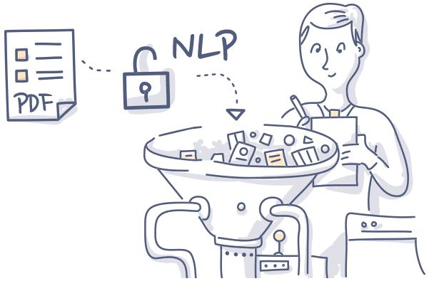

# Natural Language Processing

This repository contains basic implementations and examples of Natural Language Processing (NLP) techniques and algorithms. Whether you're new to NLP or looking to refresh your knowledge, you'll find useful resources and examples here. This repository mainly uses nltk library along with basic Python libraries to implement NLP algorithms and techniques

## Table of Contents

- [Introduction](#introduction)
- [Features](#features)
- [Contributing](#contributing)
- [License](#license)

## Introduction

Natural Language Processing (NLP) is a field of artificial intelligence that focuses on the interaction between computers and humans through natural language. It encompasses text classification, sentiment analysis, language translation, and more.

This repository is a beginner-friendly resource for understanding and implementing basic NLP techniques using popular libraries such as NLTK, spaCy, and scikit-learn.

## Features

- Implementation of common NLP tasks such as tokenization, stemming, and lemmatization.
- Basic text preprocessing techniques including stopword removal and punctuation handling.
- Examples of text classification using machine learning algorithms.
- Sentiment analysis on textual data.
- Named Entity Recognition (NER) using state-of-the-art models.

## Contributing

Contributions are welcome! Feel free to open a pull request if you have any improvements or additional examples to add. Please ensure that your code follows the repository's style and conventions.

## License

This project is licensed under the MIT License - see the [LICENSE](LICENSE) file for details.
